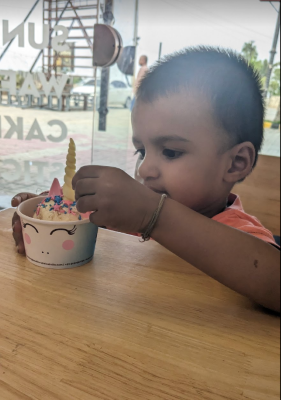

- # New Look, New Style
  
  
  
  **OK so this my yet another way to restart my blogging habit with a new look and style.** The idea as always has been to be able to migrate to completely self hosted platform without having to depend on any other platform. Now while ~~Gitlab~~ Github is not a perfectly _'Self Hosted' Platform_ it does give me some freedom to keep my data with myself.
  
  Moreover, I am trying to take this `whole control` of writing public stuff and keeping personal notes all by myself, so that I get one tool to rule them all.
  
  I think it's been far too long I have been just setting things up but without having to generate anything worthwhile. Now I just hope I am able to do something which will be regular if not frequent and which will be something that people might enjoy reading.
  
  As someone once said :-
  
  > "One of the great balancing acts in life is to be cautious and daring at the same time.
  > Cautious enough to avoid stupid mistakes, prevent burnout, and maintain a margin of safety.
  > Daring enough to bet on yourself, to do the things you would regret leaving undone, and to be willing to be uncomfortable in the short term so you can learn and grow in the long term." #quote
  
  I miss the good old days where I used to be able to write and produce blogs _at will_. I have tried to reboot my writing career so many times but have failed. This is yet another attempt. Probably a little sophisticated one, but let's see how it goes.
  
  ---
- ## Future plans
  
  Also the idea is that if this get successful, I would like to migrate my old blogs to this new domain. Let's see how it all goes. Let's all hope this time this attempt is successfully.
  
  `PS: Picture of my little boy enjoying his icecream. Of course he didn't eat it. He just 'enjoyed' it!`
  
  ---
- #blog